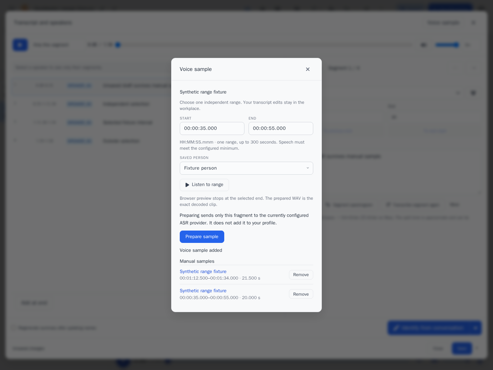

# Проверка ручных образцов голоса

Изменения проверены 8 октября 2026 года поверх `2f417d5` — общего редактора
расшифровки и спикеров с управлением яркостью спектрограммы. PR должен
сравниваться с `feat/transcript-unified-workspace`: перенос на другую базу
потребует отдельной проверки совместимости.

## Поведение и границы

Независимые поля начала/конца не меняют сегменты или несохранённый черновик.
Прослушивание исходного диапазона, подготовка PCM WAV и добавление в профиль
являются отдельными действиями. Подготовка отправляет только выбранный
фрагмент существующему ASR-провайдеру. Несколько диапазонов одной записи
сохраняются отдельно; повтор подтверждения не создаёт дубликат.

Добавлены две таблицы: ручные образцы и квитанции подтверждения. Старые
автоматические образцы сохраняют прежний API. Matching, объединение,
очистка и удаление учитывают оба типа образцов. Проверяются доступ,
принадлежность профиля, исходное аудио, текущая конфигурация и свежесть
embedding space. Клип ограничен 300 секундами и 20 MiB; временные файлы
удаляются по TTL, worker имеет deadline и поддерживает отмену.

План интерфейса: запись → независимый диапазон и сохранённый человек →
прослушивание → явная подготовка → точный WAV и диагностика → отдельное
подтверждение → список образцов с диапазонами и удалением.

## Результаты

| Проверка | Результат | Граница доказательства |
|---|---|---|
| Полный Python suite | 2796 passed, 29 skipped, 11 subtests; coverage 73.35% | Linux, Python 3.11.17; до последнего исправления двух JS-файлов, backend идентичен |
| Полный frontend, финальный источник | 538 passed, 31 files | Vitest; включает четыре регрессии загрузки людей и устаревшего открытия панели |
| Финальный браузерный сценарий и обычный smoke | 7 passed, 77.27 s | Реальные app, worker, PCM, HTTP и DB; ASR-вектор выдаёт локальный stand-in |
| Миграция копии установленной SQLite | PASS | Старые таблицы и файлы сохранены; две новые таблицы пусты; integrity_check=ok |
| Установленный Docker образ, Windows Chromium | PASS | Вход, обе кнопки, список людей, исходное аудио и сохранение черновика; без подготовки пользовательского аудио или записи в профиль |
| Существующая проверка модели на встроенном canary | status=ok, dimension=256, similarity≈1.0 | Совместимость текущего локального провайдера; без rebaseline или перестроения профилей |

После выявления гонки загрузки `/speakers` воспроизведён RED и выполнен
повторный frontend и браузерный прогон. Проверены изоляция пользователей,
отзыв доступа, истечение TTL, отмена, смена диапазона/записи, replay,
конкурентное подтверждение, lifecycle и точность PCM crop.
Post-EXEC review, отдельный adversarial pass reviewer и проверка установки
завершились PASS. Reviewer работал по поручению только чтения в writable
fallback; технический read-only sandbox не был подтверждён.

## Визуальные доказательства

Материалы получены автоматизированным тестом
`tests/e2e/test_manual_voice_browser.py` на синтетической записи и фиктивном
человеке. Пользовательских записей, рабочих профилей и production login
в этих файлах нет. Скриншот просмотрен; видео декодированы при проверке.

- [До: редактор без кнопки образца](../assets/manual-voice-samples/before.webm).
- [После: диапазон, подготовка, воспроизведение, два образца, удаление и ошибки](../assets/manual-voice-samples/after.webm).
- [Машинные результаты PCM, playback, replay и сохранения черновика](../assets/manual-voice-samples/browser-evidence.json).



Production UI материалы, рабочая SPEC с журналом и подробные резервные копии
остаются локальными. Этот документ содержит переносимое описание результата.

## Повторение браузерной проверки

Нужны Linux, зависимости приложения, ffmpeg, Gunicorn и Playwright Chromium.
Использовать новый изолированный каталог; не подключать production instance
или uploads. Fixture создаёт собственные данные и локальный HTTP ASR stand-in.

```sh
python tests/e2e/manual_voice_fixture.py --workdir /tmp/speakr-manual-fixture-new --port 18899
# В другом терминале той же изолированной среды:
SPEAKR_MANUAL_BROWSER=1 SPEAKR_BASE_URL=http://127.0.0.1:18899 \
  SPEAKR_MANUAL_FIXTURE_WORKDIR=/tmp/speakr-manual-fixture-new \
  SPEAKR_MANUAL_EVIDENCE=/tmp/speakr-manual-evidence \
  python -m pytest -q tests/e2e/test_manual_voice_browser.py
npm test
```

Opt-in браузерный тест штатно пропускается без этих переменных. Для полного
Python suite нужны зависимости и окружение существующего CI workflow.

## Ограничения и откат

Тестовый провайдер не доказывает точность распознавания, принадлежность голоса
или физическое прослушивание человеком. Windows native ACL отдельно не
подтверждён; установленное приложение проверено в Linux Docker.
Свежая canary-проверка требуется не старше 24 часов; она не обнаруживает
скрытую замену модели при неизменных настройках и размерности.

Данные добавляются штатным initializer. После появления ручных образцов
старый binary не учитывает их matching и lifecycle. Для отката сначала
остановить обработку и приложение, затем проверить обе новые таблицы на
холодной базе. Старый binary допустим только при пустых таблицах; иначе
нужна совместимая исправленная версия. Старую резервную базу автоматически
поверх актуальной не восстанавливать.

Релиз, merge и установка в другие окружения этим PR не выполняются.
Порядок использования описан в [руководстве](../user-guide/manual-voice-samples.md).
